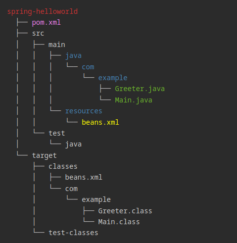

# <sg>Clase 1 - Curso de Spring</sg>

## <sg>Enlaces importantes</sg>

* https://spring.io (página oficial de Spring)
* https://mvnrepository.com (repositorio de código de Maven)

## <sg>Configuración de dependencias en el archivo pom.xml (configuración de Maven)</sg>

[pom.xml](./spring-helloworld/pom.xml)

```xml
<dependencies>
    <dependency>
        <groupId>org.springframework</groupId>
        <artifactId>spring-context</artifactId>
        <version>6.1.11</version>
    </dependency>
</dependencies>
```

## <sg>Estructura del IoC container con XML</sg>

[beans.xml](./spring-helloworld/src/main/resources/beans.xml)

```xml
<?xml version="1.0" encoding="UTF-8"?>
<beans xmlns="http://www.springframework.org/schema/beans"
	xmlns:xsi="http://www.w3.org/2001/XMLSchema-instance"
	xsi:schemaLocation="http://www.springframework.org/schema/beans
		https://www.springframework.org/schema/beans/spring-beans.xsd">

	<bean id="identificadorDelBean" class="com.example.ClaseDelBean" scope="prototype">
	</bean>

</beans>
```

Fuente: https://docs.spring.io/spring-framework/reference/core/beans/basics.html#beans-factory-xml

## <sg>Estructura del proyecto</sg>

[Nota]: # (Esta es la estructura del proyecto de la cual saqué la captura que inserto más abajo. Esto es debido a que github no la interpreta adecuadamente.)
[//]: # (<pre>)
[//]: # (<r>spring-helloworld</r>)
[//]: # (  ├── <v>pom.xml</v>)
[//]: # (  ├── src)
[//]: # (  │   ├── main)
[//]: # (  │   │   ├── <sb>java</sb>)
[//]: # (  │   │   │   └── <sb>com</sb>)
[//]: # (  │   │   │       └── <sb>example</sb>)
[//]: # (  │   │   │           ├── <sg>Greeter.java</sg>)
[//]: # (  │   │   │           └── <sg>Main.java</sg>)
[//]: # (  │   │   └── <sb>resources</sb>)
[//]: # (  │   │       └── <y>beans.xml</y>)
[//]: # (  │   └── test)
[//]: # (  │       └── java)
[//]: # (  └── target)
[//]: # (      ├── classes)
[//]: # (      │   ├── beans.xml)
[//]: # (      │   └── com)
[//]: # (      │       └── example)
[//]: # (      │           ├── Greeter.class)
[//]: # (      │           └── Main.class)
[//]: # (      └── test-classes)
[//]: # (</pre>)



> [!NOTE]
> Los archivos resaltados en color son los que se han trabajado

---

<style>
    y {color: yellow}
	r {color: #C33}
	v {color: violet}
	sb {color: steelblue}
	sg {color: #6CB52D} /* Spring Green */
</style>
