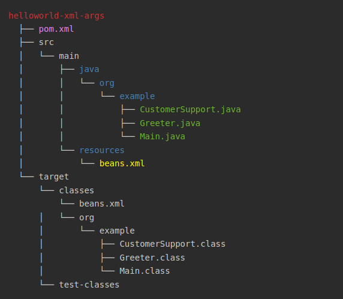
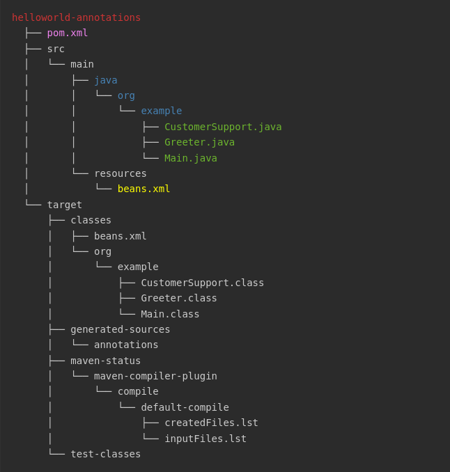

# <sg>Clase 2 - Curso de Spring</sg>

## <sg>Beans con XML y argumentos (helloworld-xml-args)</sg>

<sg>Los argumentos se pasan en el bean, para instanciar la clase,
usando la etiqueta</sg> <sb>\<constructor-args name="" value="" \/\></sb>

[beans.xml](./helloworld-xml-args/src/main/resources/beans.xml)

```xml
<bean id="customerSupport" class="org.example.CustomerSupport">
    <!-- Aquí le paso los argumentos al constructor de la clase -->
    <constructor-arg name="applicationName" value="CS-3000" />
    <constructor-arg name="greeter" ref="greeter" />
</bean>
```

Fuente: https://docs.spring.io/spring-framework/reference/core/beans/dependencies/factory-collaborators.html#beans-constructor-injection

### <sg>Estructura del proyecto (helloworld-xml-args)</sg>

[Nota]: # (Esta es la estructura del proyecto de la cual saqué la captura que inserto más abajo. Esto es debido a que github no la interpreta adecuadamente.)

[//]: # (<pre>)
[//]: # (<r>helloworld-xml-args</r>)
[//]: # (  ├── <v>pom.xml</v>)
[//]: # (  ├── src)
[//]: # (  │   └── main)
[//]: # (  │       ├── <sb>java</sb>)
[//]: # (  │       │   └── <sb>org</sb>)
[//]: # (  │       │       └── <sb>example</sb>)
[//]: # (  │       │           ├── <sg>CustomerSupport.java</sg>)
[//]: # (  │       │           ├── <sg>Greeter.java</sg>)
[//]: # (  │       │           └── <sg>Main.java</sg>)
[//]: # (  │       └── <sb>resources</sb>)
[//]: # (  │           └── <y>beans.xml</y>)
[//]: # (  └── target)
[//]: # (      └── classes)
[//]: # (          └── beans.xml)
[//]: # (      │   └── org)
[//]: # (      │       └── example)
[//]: # (      │           ├── CustomerSupport.class)
[//]: # (      │           ├── Greeter.class)
[//]: # (      │           └── Main.class)
[//]: # (      └── test-classes)
[//]: # (</pre>)



> [!NOTE]
> Los archivos resaltados en color son los que se han trabajado

## <sg>Beans con annotations (helloworld-annotations)</sg>

<sg>Se auto escanean los beans sin necesidad de declararlos, con la siguente configuración:</sg>

[beans.xml](./helloworld-annotations/src/main/resources/beans.xml)

```xml
<?xml version="1.0" encoding="UTF-8"?>
<beans xmlns="http://www.springframework.org/schema/beans"
	xmlns:xsi="http://www.w3.org/2001/XMLSchema-instance"
	xmlns:context="http://www.springframework.org/schema/context"
	xsi:schemaLocation="http://www.springframework.org/schema/beans
		https://www.springframework.org/schema/beans/spring-beans.xsd
		http://www.springframework.org/schema/context
		https://www.springframework.org/schema/context/spring-context.xsd">

	<context:component-scan base-package="org.example" />
		
</beans>
```

Fuente: https://docs.spring.io/spring-framework/reference/core/beans/classpath-scanning.html#beans-scanning-autodetection

## <sg>Annotations</sg>

<sg>
En las clases que serán instanciadas por Spring, cuyos objetos serán utilizados
como beans, se utilizan algunas anotaciones, por ejemplo para indicarle a Spring
que esa clase será un componente a través de la annotation @Component.<br>
<br>
En este proyecto se utilizaron 2 annotations:

- @Component
- @Value

Como ejemplo, para indicar que una clase será usada por Spring como bean, suamos la anotación @Component como sigue:

```java
import org.springframework.stereotype.Component;

@Component
public class UnaClase {

    // código

}
```

En el caso de @Value se utiliza para pasar un valor a un argumento de, por ejemplo, el constructor de la clase, como se ve a continuación:

```java
import org.springframework.beans.factory.annotation.Value;

public class UnaClase {

    UnaClase(@Value("Soy Una Clase") String msg) {
        // código
    }

}
```
</sg>

### <sg>Estructura del proyecto (helloworld-annotations)</sg>

[Nota]: # (Esta es la estructura del proyecto de la cual saqué la captura que inserto más abajo. Esto es debido a que github no la interpreta adecuadamente.)

[//]: # (<pre>)
[//]: # (<r>helloworld-annotations</r>)
[//]: # (  ├── <v>pom.xml</v>)
[//]: # (  ├── src)
[//]: # (  │   └── main)
[//]: # (  │       ├── <sb>java</sb>)
[//]: # (  │       │   └── <sb>org</sb>)
[//]: # (  │       │       └── <sb>example</sb>)
[//]: # (  │       │           ├── <sg>CustomerSupport.java</sg>)
[//]: # (  │       │           ├── <sg>Greeter.java</sg>)
[//]: # (  │       │           └── <sg>Main.java</sg>)
[//]: # (  │       └── resources)
[//]: # (  │           └── <y>beans.xml</y>)
[//]: # (  └── target)
[//]: # (      ├── classes)
[//]: # (      │   ├── beans.xml)
[//]: # (      │   └── org)
[//]: # (      │       └── example)
[//]: # (      │           ├── CustomerSupport.class)
[//]: # (      │           ├── Greeter.class)
[//]: # (      │           └── Main.class)
[//]: # (      ├── generated-sources)
[//]: # (      │   └── annotations)
[//]: # (      ├── maven-status)
[//]: # (      │   └── maven-compiler-plugin)
[//]: # (      │       └── compile)
[//]: # (      │           └── default-compile)
[//]: # (      │               ├── createdFiles.lst)
[//]: # (      │               └── inputFiles.lst)
[//]: # (      └── test-classes)
[//]: # (</pre>)



> [!NOTE]
> Los archivos resaltados en color son los que se han trabajado

---

<style>
    y {color: yellow}
	r {color: #C33}
	v {color: violet}
	sb {color: steelblue}
	sg {color: #6CB52D} /* Spring Green */
</style>
